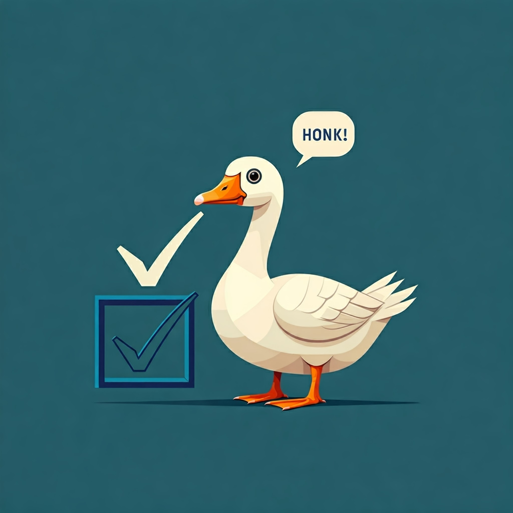

# KoboToolbox Goose Load Testing

# Install

- Ensure Rust is [installed](https://www.rust-lang.org/tools/install)
-`cargo run --release -- --host https://kf.kobotoolbox.org`

(Omit --release when debugging for a faster build)

